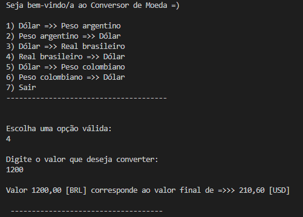
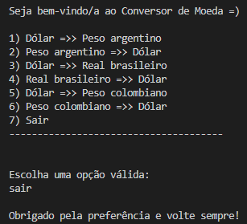

# 💱 Conversor de Moedas - Java (Terminal)

Este é um projeto simples de **conversor de moedas** desenvolvido em Java, que utiliza a API do ExchangeRate para consultar taxas de câmbio em tempo real. O usuário pode interagir via terminal para converter valores entre moedas como dólar, real, peso argentino e peso colombiano.

---

## 🚀 Tecnologias Utilizadas

- **Java 17+**
- **HttpClient (java.net.http)**
- **ExchangeRate API**

---

## 📦 Como Executar o Projeto

1. **Clone o repositório:**
   ```bash
   git clone https://github.com/luana-76/ChallengeConversorDeMoedas.git

2. **Abra o projeto em uma IDE Java (como IntelliJ ou Eclipse) ou use o terminal.**

3. **Compile e execute o projeto.**

## 🎯 Moedas Suportadas

O menu de opções do programa inclui:

- **Dólar → Peso argentino**
- **Peso argentino → Dólar**
- **Dólar → Real brasileiro**
- **Real brasileiro → Dólar**
- **Dólar → Peso colombiano**
- **Peso colombiano → Dólar**

## Exemplo de Uso



> **Aviso:** Para sair, você pode digitar a palavra sair ou o número sete(7):



